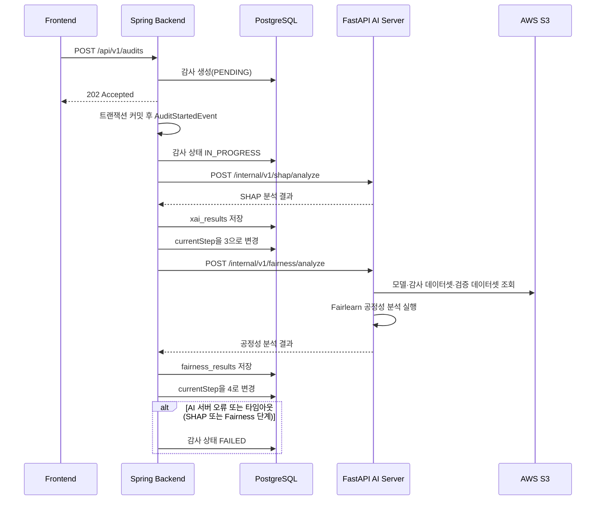

# Fairlearn AI 서버 연동

## 1. 목적

백엔드에 저장된 모델·감사 데이터셋·검증 데이터셋 정보를 AI 서버에 전달하여 Fairlearn 기반 공정성(편향) 분석을 실행하고, 반환된 결과를 `fairness_results` 테이블에 저장한다.

외부 사용자는 공정성 결과 저장 기능을 직접 호출할 수 없다. SHAP 분석 완료 이후 백엔드 내부에서만 AI 서버 호출과 결과 저장이 수행된다.

---

## 2. 전체 처리 흐름



---

## 3. 호출 시점

SHAP과 별도의 트리거는 없다. `AuditAnalysisEventListener.handle()`이 `AuditStartedEvent`를 처리하는 하나의 비동기 흐름 안에서, SHAP 분석과 결과 저장이 성공하면 곧바로 이어서 Fairlearn 분석을 요청한다.

SHAP 단계가 실패하면(AI 서버 오류·타임아웃·기타 런타임 예외) 감사는 즉시 `FAILED`로 전환되고 Fairlearn 분석은 실행되지 않는다.

---

## 4. 백엔드–AI 서버 계약

### Endpoint

```http
POST /internal/v1/fairness/analyze
Content-Type: application/json
```

> **주의**: `FairnessRunResponse` 설계 당시 참고한 AI 팀 원본 계약 문서에는 이 API 경로가 `POST /api/fairness/audits`로 되어 있었다. 이 프로젝트는 SHAP과의 내부 연동 경로 컨벤션(`/internal/v1/{feature}/analyze`)에 맞춰 `/internal/v1/fairness/analyze`를 잠정 사용한다. AI 서버 실제 배포 경로가 확정되면 `FastApiFairnessAnalysisClient`의 경로 상수만 조정하면 된다.

### 요청 예시

```json
{
  "audit_id": 21,
  "model_s3_key": "models/uuid_credit_model.json",
  "audit_dataset_s3_key": "datasets/uuid_audit_dataset.csv",
  "validation_dataset_s3_key": "datasets/uuid_valid_processed.csv",
  "audit_name": "2026년 상반기 신용평가 모델 감사",
  "target_approval_rate": 0.9,
  "manual_threshold": null,
  "sensitive_features": ["CODE_GENDER", "AGE_GROUP"]
}
```

### 요청 필드

| 필드 | 타입 | 필수 | 설명 |
| --- | --- | --- | --- |
| `audit_id` | Long | Y | 백엔드 감사 식별자 |
| `model_s3_key` | String | Y | S3에 저장된 모델 객체 Key |
| `audit_dataset_s3_key` | String | Y | S3에 저장된 감사 데이터셋 객체 Key |
| `validation_dataset_s3_key` | String | N | 임계값 보정용 검증 데이터셋 Key. 없으면 AI 서버가 감사 데이터셋으로 폴백 |
| `audit_name` | String | Y | 감사명 |
| `target_approval_rate` | Decimal | N | 목표 승인율 (manual_threshold와 동시에 없으면 AI 서버 기본값 0.90 사용) |
| `manual_threshold` | Decimal | N | 수동 임계값 (있으면 target_approval_rate보다 우선) |
| `sensitive_features` | String[] | Y | 민감변수 컬럼 목록 |

### 응답

`FairnessRunResponse`(`AuditRunResponse` 미러링)로 역직렬화되며, 이 중 `fairness_by_attribute` 맵만 저장에 사용한다. 맵의 키는 보호속성 컬럼명(예: `CODE_GENDER`), 값은 해당 속성의 `demographic_parity_difference`/`equal_opportunity_difference`/`equalized_odds_difference`를 담은 `AttributeFairness`다.

AI 서버 응답은 `FairnessResultService.saveFairnessResult()`를 통해 저장된다.

---

## 5. MVP 정책

### Threshold 및 판정 기준 (미확정)

`FairnessResultEntity.threshold`는 SHAP과 달리 AI 서버가 내려주지 않고 백엔드가 채우는 정책값이다. 현재는 지표별로 고정 상수(`DEMOGRAPHIC_PARITY`/`EQUAL_OPPORTUNITY`/`EQUALIZED_ODDS` 각 `0.10`)를 사용하고, 값의 절대값과 임계값을 비교해 다음과 같이 3단계로 판정한다.

- `|value| <= threshold` → `PASS`
- `threshold < |value| <= 2 * threshold` → `REVIEW`
- `|value| > 2 * threshold` → `FAIL`

**이 임계값과 배수 기준은 정책적으로 확정된 값이 아니다.** AI팀·기획 확정 후 `FairnessResultService`의 상수와 `judgeStatus` 로직을 조정해야 한다.

### DISPARATE_IMPACT 미사용

`FairnessMetricCode`에는 `DISPARATE_IMPACT`가 정의되어 있으나, AI 서버 응답(`AttributeFairness`)에 대응하는 필드가 없어 이번 구현에서는 저장하지 않는다. 실제로 저장되는 지표는 `DEMOGRAPHIC_PARITY`, `EQUAL_OPPORTUNITY`, `EQUALIZED_ODDS` 3개뿐이다.

### 검증 데이터셋 조회

같은 모델(`AiModelEntity`)에 속한 `DatasetPurpose.VALIDATION` 데이터셋 중 가장 최근에 업로드된 것을 사용한다. 존재하지 않으면 `validation_dataset_s3_key`를 `null`로 전달하고, AI 서버가 감사 데이터셋으로 폴백한다.

---

## 6. 감사 상태 변화

| 처리 시점 | `AuditStatus` | `currentStep` |
| --- | --- | --- |
| 감사 생성 | `PENDING` | 1 |
| SHAP 분석 시작 | `IN_PROGRESS` | 1 |
| SHAP 분석 및 저장 성공 | `IN_PROGRESS` | 3 |
| 공정성 분석 및 저장 성공 | `IN_PROGRESS` | 4 |
| AI 서버 오류 또는 타임아웃 (SHAP·Fairness 공통) | `FAILED` | 기존 단계 유지 |
| AI 서버 비활성화 | `FAILED` | 기존 단계 유지 |

공정성 분석 성공도 SHAP과 마찬가지로 감사 전체 완료를 의미하지 않는다. 최종 판정(`COMPLIANT`/`WARNING`/`NON_COMPLIANT`/`UNCONFIRMED`)으로 전환하는 로직은 이번 구현 범위에 포함되지 않으며, `AuditStatus`는 `IN_PROGRESS`로 유지되고 `currentStep`만 4로 이동한다.

---

## 7. 오류 처리

| 상황 | ErrorCode | HTTP 의미 |
| --- | --- | --- |
| AI 서버 호출 실패 또는 비정상 응답 | `EA001` | Bad Gateway |
| AI 서버 응답 시간 초과 | `EA002` | Gateway Timeout |
| 공정성 감사 결과를 찾을 수 없음 | `EM014` | Not Found |

SHAP과 동일하게 Fairlearn 호출도 감사 생성 응답 이후 비동기로 실행되므로, EA001·EA002가 `POST /api/v1/audits` 응답으로 직접 반환되지는 않는다.

---

## 8. 환경변수

SHAP과 동일한 AI 서버 설정을 공유하며, 신규 환경변수는 없다.

```properties
AI_SERVER_ENABLED=false
AI_SERVER_BASE_URL=http://localhost:8000
AI_SERVER_CONNECT_TIMEOUT=3s
AI_SERVER_READ_TIMEOUT=120s
```

---

## 9. 외부 API 경계

이번 구현에서 공개 조회 API(`GET /api/v1/audits/{auditId}/fairness`)는 포함하지 않는다. `FairnessResultService.getFairness()` 서비스 메서드까지만 제공하며, 컨트롤러는 별도 담당자가 추가한다.

다음 저장용 API는 제공하지 않으며 앞으로도 제공할 계획이 없다.

```http
POST /api/v1/audits/{auditId}/fairness
```

공정성 결과 저장은 백엔드 내부의 `FairnessAnalysisService`와 `FairnessResultService`를 통해서만 수행된다.
