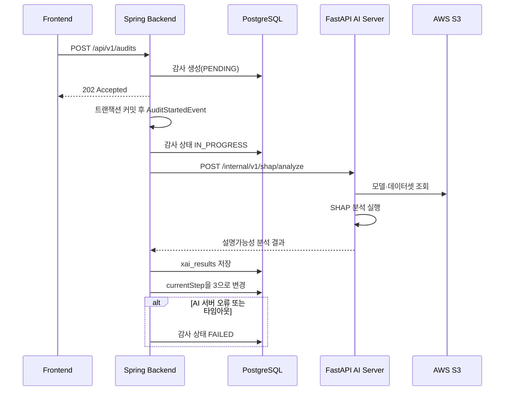

# SHAP AI 서버 연동

## 1. 목적

백엔드에 저장된 모델·감사 데이터셋 정보를 AI 서버에 전달하여 SHAP 설명가능성 분석을 실행하고, 반환된 결과를 `xai_results` 테이블에 저장한다.

외부 사용자는 SHAP 결과 저장 기능을 직접 호출할 수 없다. 감사 생성 이후 백엔드 내부 이벤트를 통해서만 AI 서버 호출과 결과 저장이 수행된다.

---

## 2. 전체 처리 흐름



---

## 3. 호출 시점

프론트엔드는 다음 API로 감사를 생성한다.

```http
POST /api/v1/audits
```

백엔드는 감사 생성 직후 `202 Accepted`와 `PENDING` 상태를 반환한다.

감사 생성 트랜잭션이 성공적으로 커밋되면 `AuditStartedEvent`가 발행된다. `ShapAnalysisEventListener`는 별도 비동기 스레드에서 이벤트를 처리하고 FastAPI AI 서버에 SHAP 분석을 요청한다.

트랜잭션이 롤백된 경우 이벤트 리스너는 실행되지 않는다.

---

## 4. 백엔드–AI 서버 계약

### Endpoint

```http
POST /internal/v1/shap/analyze
Content-Type: application/json
```

이 경로는 프론트엔드에 공개되는 API가 아니라 Spring 백엔드가 FastAPI에 요청하는 내부 연동 API다.

### 요청 예시

```json
{
  "audit_id": 21,
  "model_s3_key": "models/uuid_credit_model.json",
  "audit_dataset_s3_key": "datasets/uuid_audit_dataset.csv",
  "target_column": "TARGET",
  "sensitive_features": [
    "CODE_GENDER",
    "AGE_GROUP",
    "REGION_RATING_CLIENT"
  ]
}
```

### 요청 필드

| 필드 | 타입 | 필수 | 설명 |
| --- | --- | --- | --- |
| `audit_id` | Long | Y | 백엔드 감사 식별자 |
| `model_s3_key` | String | Y | S3에 저장된 모델 객체 Key |
| `audit_dataset_s3_key` | String | Y | S3에 저장된 감사 데이터셋 객체 Key |
| `target_column` | String | Y | 정답 레이블 컬럼명 |
| `sensitive_features` | String[] | Y | 민감변수 컬럼 목록 |

### 응답 예시

```json
{
  "pipeline_status": "COMPLETED",
  "overall_status": "WARNING",
  "key_metrics": {
    "sensitive_contribution_ratio": {
      "metric": "SENSITIVE_CONTRIB",
      "label": "민감변수 기여비율",
      "value": 0.0647,
      "threshold": 0.2000,
      "status": "PASS"
    },
    "global_explanation_stability": {
      "metric": "GLOBAL_STABILITY",
      "label": "전역 설명 안정성",
      "value": 0.9996,
      "threshold": 0.7000,
      "status": "PASS"
    },
    "explanation_fidelity": {
      "metric": "FIDELITY",
      "label": "설명 충실성",
      "value": 0.4843,
      "threshold": 0.5000,
      "status": "WARNING"
    }
  }
}
```

AI 서버 응답은 `ExplainabilityResultRequest`로 역직렬화되며, `ExplainabilityService.saveExplainabilityResult()`를 통해 저장된다.

---

## 5. MVP 정책

### Target 컬럼

MVP에서는 데이터셋의 정답 레이블 컬럼을 다음 값으로 고정한다.

```text
TARGET
```

추후 다양한 데이터셋을 지원할 경우 Dataset 엔티티 또는 감사 생성 요청에서 `targetColumn`을 관리하도록 확장할 수 있다.

### S3 파일 전달

MVP에서는 Presigned URL이 아닌 S3 Key를 AI 서버에 전달한다.

AI 서버는 백엔드와 동일한 S3 버킷에 접근할 수 있는 IAM 권한과 AWS 리전을 설정해야 한다.

Presigned URL이 필요해질 경우 `ShapAnalysisRequest`와 파일 접근 방식만 변경할 수 있도록 AI 서버 호출 로직을 Client 인터페이스로 분리했다.

### 민감변수

감사 생성 시점에 저장한 `AuditEntity.sensitiveFeatures` 값을 콤마 기준으로 분리한다. 각 값의 앞뒤 공백을 제거하고 중복을 제거한 후 AI 서버에 배열로 전달한다.

---

## 6. 감사 상태 변화

| 처리 시점 | `AuditStatus` | `currentStep` |
| --- | --- | --- |
| 감사 생성 | `PENDING` | 1 |
| SHAP 분석 시작 | `IN_PROGRESS` | 1 |
| SHAP 분석 및 저장 성공 | `IN_PROGRESS` | 3 |
| AI 서버 오류 또는 타임아웃 | `FAILED` | 기존 단계 유지 |
| AI 서버 비활성화 | `FAILED` | 기존 단계 유지 |

SHAP 분석 성공은 전체 감사 완료를 의미하지 않는다. 이후 Fairlearn 등 다음 감사 단계가 남아 있으므로 최종 감사 상태는 `IN_PROGRESS`로 유지하고 `currentStep`만 3으로 이동한다.

---

## 7. 오류 처리

| 상황 | ErrorCode | HTTP 의미 |
| --- | --- | --- |
| AI 서버 호출 실패 또는 비정상 응답 | `EA001` | Bad Gateway |
| AI 서버 응답 시간 초과 | `EA002` | Gateway Timeout |

SHAP 호출은 감사 생성 응답 이후 비동기로 실행된다. 따라서 EA001·EA002가 `POST /api/v1/audits` 응답으로 직접 반환되지는 않는다.

비동기 처리 중 오류가 발생하면 다음과 같이 처리한다.

1. 감사 상태를 `FAILED`로 변경
2. 감사 ID와 오류 코드를 서버 로그에 기록
3. SHAP 완료 단계로 이동하지 않음

---

## 8. 환경변수

```properties
AI_SERVER_ENABLED=false
AI_SERVER_BASE_URL=http://localhost:8000
AI_SERVER_CONNECT_TIMEOUT=3s
AI_SERVER_READ_TIMEOUT=120s
```

| 환경변수 | 기본값 | 설명 |
| --- | --- | --- |
| `AI_SERVER_ENABLED` | `false` | FastAPI SHAP 분석 실행 여부. `false`이면 AI 서버를 호출하지 않고 감사를 `FAILED`로 전환 |
| `AI_SERVER_BASE_URL` | `http://localhost:8000` | FastAPI AI 서버 주소 |
| `AI_SERVER_CONNECT_TIMEOUT` | `3s` | AI 서버 연결 제한 시간 |
| `AI_SERVER_READ_TIMEOUT` | `120s` | SHAP 응답 대기 제한 시간 |

`AI_SERVER_ENABLED=false`이면 감사 생성 이벤트는 처리되지만 FastAPI를 호출하지 않고 감사 상태를 `FAILED`로 변경한다. 실제 SHAP 감사를 실행하는 환경에서는 반드시 `true`로 설정해야 한다.

---

## 9. 외부 API 경계

외부에 공개되는 설명가능성 API는 조회 기능뿐이다.

```http
GET /api/v1/audits/{auditId}/explainability
```

다음 저장용 API는 제공하지 않는다.

```http
POST /api/v1/audits/{auditId}/explainability
```

SHAP 결과 저장은 백엔드 내부의 `ShapAnalysisService`와 `ExplainabilityService`를 통해서만 수행된다.